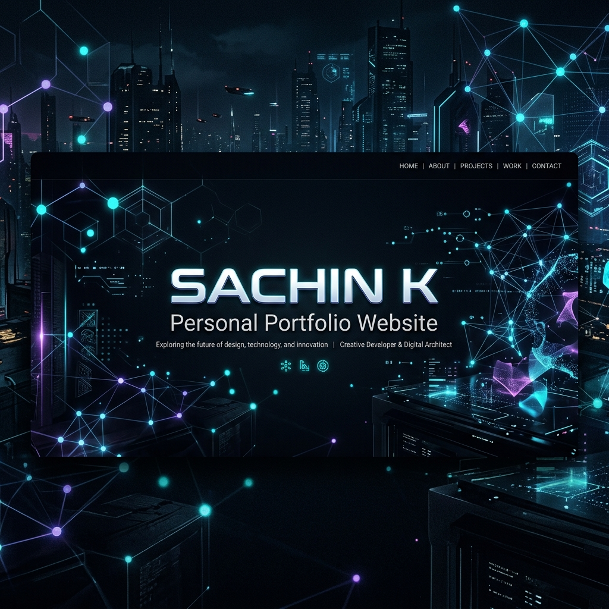

<p align="center">
  
</p>

<p align="center">
  
</p>

<p align="center">
  <a href="https://portfolio-website-chi.vercel.app/">
    
  </a>
  
  
  
  
  
  
  
  
</p>

---

## 📖 Overview

Welcome to my personal, high-fidelity portfolio website. Designed as a dark luxury, state-of-the-art interactive playground, this site showcases my professional path, key engineering projects, academic background, and development competencies. Leveraging physics-based animations, hardware-accelerated WebGL environments, and fully responsive layouts, it represents the intersection of structural engineering and digital art.

---

## ✨ Key Features

* 🌌 **Interactive WebGL Star & Wave Field**: A dynamic, fully-custom Three.js canvas renders a responsive dotted wave landscape in the background, responding in real-time to page navigations.
* 🔮 **D3.js Force-Directed Skills Graph**: Under the `Skills` stage, nodes collide and stack organically using a full physics force-simulation with:
  * 🧲 **Magnetic Mouse Follower**: Nodes gather and swarm dynamically toward your cursor inside the stage.
  * 📱 **Mobile Tilt/Gyro Flow**: Mobile users can tilt their devices to let the skill nodes slide and roll fluidly like water in response to physical gravity.
* 💎 **Glassmorphism Glass UI Theme**: All containers, project panels, form inputs, and certificates use transparent backdrop-blur filters, giving a cohesive floating luxury feel.
* ⚡ **Staggered Spring Animations**: Page transitions, mobile menus, and layout items animate via smooth, hardware-accelerated Framer Motion spring vectors (`stiffness: 150`, `damping: 15`).
* 📨 **Secure Functional Contact Channel**: Features a direct, verified contact form powered client-side by EmailJS with real-time UI loading and status validation states.
* 🧩 **Modern Single-Page Navigation**: Implements seamless path-routing via React Router with lazy loading and an aesthetic neon load screen.

---

## 🛠️ Tech Stack & Core Integrations

* **Core Engine**: `React.js v18` - Serves as the robust, modular component framework.
* **Physics & WebGL Rendering**: 
  * `D3.js` - Computes physical particle collisions and dynamic forces.
  * `Three.js` - Coordinates WebGL 3D math and hardware-accelerated canvas structures.
* **Styling & Fluid UI**:
  * `Tailwind CSS v3` - Powers utilities and baseline system structures.
  * `Custom CSS Modules` - Handles glassmorphic rules, customized scrollbars, and aesthetic layout variables.
* **Animations**: `Framer Motion` - orchestrates spatial layouts, menu spring animations, and page entrances.
* **Serverless Services**:
  * `EmailJS` - Dispatches secure SMTP messages directly from frontend components.
  * `Vercel` - Provides robust global hosting, continuous integration, and fast CDN pipelines.

---

## 🗺️ Project Directory Map

```text
.
├── postcss.config.js         # PostCSS configurations for Tailwind
├── tailwind.config.js        # Custom Tailwind spacing, variables, and themes
├── vite.config.mjs           # Bundler config & path aliases
├── package.json              # Main project dependencies & scripts
├── index.html                # App entry document
├── portfolio_banner.png      # Luxury visual repository banner
├── public/
│   ├── resume.pdf            # Professional Resume PDF
│   └── gallery/              # Achievement & program badge assets
└── src/
    ├── App.jsx               # Navigation router & global animated backdrop
    ├── main.jsx              # React initialization & dark-mode theme wrapper
    ├── index.css             # Main styling, custom stars, and global variables
    ├── CSS/                  # Isolated page & navbar stylesheets
    │   ├── About.css
    │   ├── Certificates.css
    │   ├── Contact.css
    │   ├── Gallery.css
    │   ├── Home.css
    │   ├── Navbar.css
    │   ├── Resume.css
    │   ├── Skills.css
    │   ├── blog.css
    │   └── projects.css
    ├── components/           # Reusable components
    │   ├── Navbar.jsx
    │   └── ui/
    │       └── dotted-surface.jsx  # Custom 3D WebGL background grid
    ├── lib/                  # Utility classes
    │   └── utils.js          # cn Tailwind merger helper
    └── pages/                # High-fidelity layout pages
        ├── About.jsx
        ├── Blog.jsx
        ├── Certificates.jsx
        ├── Contact.jsx
        ├── Gallery.jsx
        ├── Home.jsx
        ├── NotFound.jsx
        ├── Projects.jsx
        ├── Resume.jsx
        └── Skills.jsx
```

---

## ⚙️ Setup & Installation

### Prerequisite Checklist
* Make sure you have [Node.js](https://nodejs.org/) installed (v18.x or higher recommended).
* A GitHub account and Git CLI configured.

Follow these steps to run the portfolio website locally on your machine:

```bash
# 1️⃣ Clone the repository
git clone https://github.com/Sachinxcode-01/portfilio-website.git

# 2️⃣ Navigate into the project folder
cd Sachinxcode

# 3️⃣ Install modern dependencies
npm install

# 4️⃣ Set up environment variables
# Create a .env file in the root directory and add your EmailJS keys:
# VITE_EMAILJS_SERVICE_ID=your_service_id
# VITE_EMAILJS_TEMPLATE_ID=your_template_id
# VITE_EMAILJS_PUBLIC_KEY=your_public_key

# 5️⃣ Fire up the local Vite development server
npm run dev
```

🚀 Open your browser and navigate to **[http://localhost:5173/](http://localhost:5173/)** to see the interactive environment in action!

---

## 🗂️ Sections Walkthrough

* **🏠 Hero Grid**: Welcomes users with an interactive, neon-styled layout featuring professional taglines, typing effects, profile image frames, and responsive quick-links.
* **👨‍💻 About Block**: Contains bio blocks reflectingCSE learning directions and showcases details of current and completed academic courses.
* **⚙️ Interactive Skills**: Houses the D3 physics node stage where visitors can drag nodes, tilt their mobile devices to feel gravity, or move their cursors to watch nodes follow the mouse organically.
* **🚀 Project Grid**: Showcases major full-stack and machine learning software solutions with direct link options and animated indicator badges.
* **🏅 Achievements Feed**: Houses high-resolution Google Cloud badges and hackathon prototypes in floating responsive carousels with zoom capabilities.
* **📄 Integrated Resume**: Serves a fast inline preview of my CV with download integration directly to local filesystems.
* **📝 Growth Blog**: Integrates interactive post items with thumbs-up and thumbs-down reaction mechanisms persisted across sessions.
* **🤝 Contact Gate**: Provides inputs for name, contact points, and direct messaging with full UI feedback and validation.

---

## 📬 Contact & Socials

Let's collaborate, innovate, and build something incredible together:

* 📧 **Primary Email**: [saxhin0708@gmail.com](mailto:saxhin0708@gmail.com)
* 💼 **LinkedIn Profile**: [linkedin.com/in/sachin-k-5b6689322](https://www.linkedin.com/in/sachin-k-5b6689322)
* 💻 **GitHub Hub**: [github.com/Sachinxcode-01](https://github.com/Sachinxcode-01)
* 🚀 **Vercel Live URL**: [portfolio-website-chi.vercel.app](https://portfolio-website-chi.vercel.app/)

---

## 📄 License

Distributed under the **MIT License**. Check out the `LICENSE` file for more details. Feel free to clone, build upon, or modify this template for your own works! ⭐

---

<p align="center">
  Made with ❤️ by <a href="https://github.com/Sachinxcode-01"><b>Sachin K</b></a>
</p>
